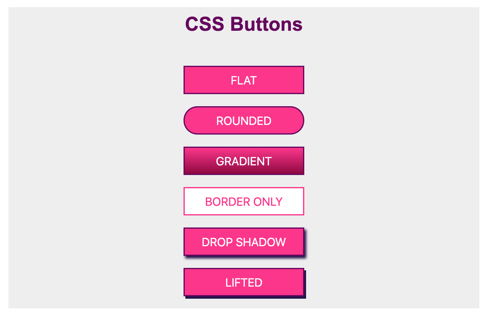
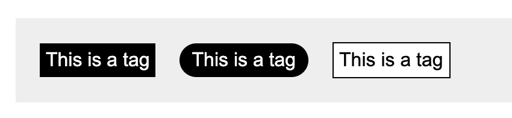
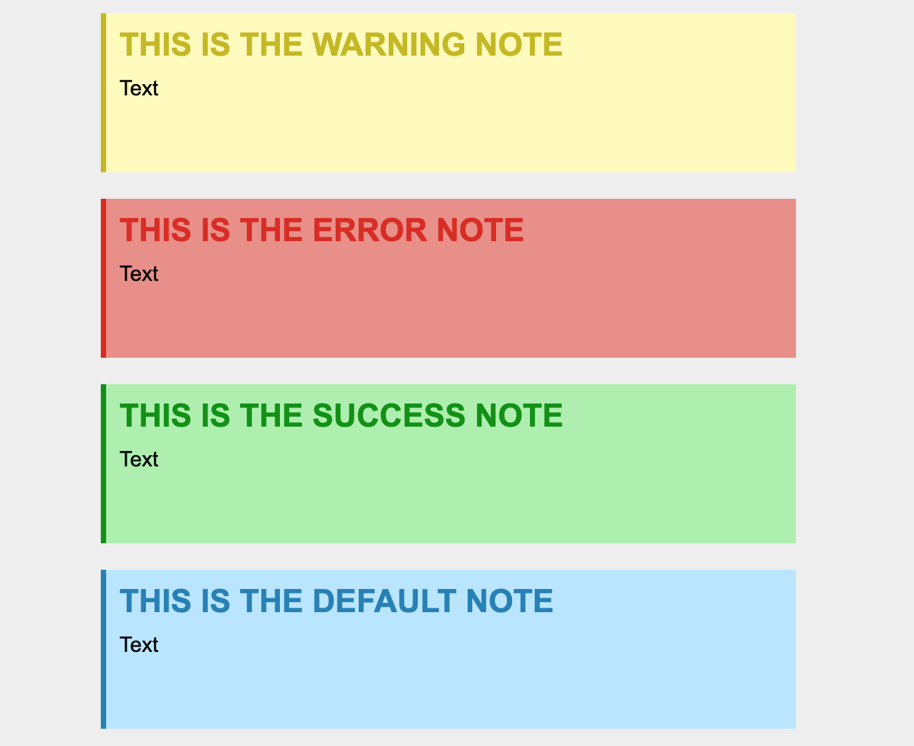

# CSS3 New Features Code Demos & more.

This repo is dedicated to all the new CSS features releasing in the CSS.
This is WIP repo and less jazzy UI (I know it should be jazzy , as we are talking about CSS).

# TOC

## New Features

- :white_check_mark: calc
- :white_check_mark: counter
- :white_check_mark: filters
- flexbox
- grids
- :white_check_mark: mixins [UPDATE: NOT ANYMORE SUPPORTED]
- :white_check_mark: scroll behaviour
- :white_check_mark: variables
- :white_check_mark: writing modes
- :white_check_mark: current color

# CSS Ready to use code

- :white_check_mark: Buttons
- :white_check_mark: Alerts & Notification
- :white_check_mark: Tags
- :white_check_mark: List
- Navigation
- Layouts
- Gallery
- Accordion

# CONTENT [WIP]

### CSS Buttons



### CSS Tags



### CSS Alerts



- current color

```sh
 .border{
     color: red;
     border: 1px solid currentColor;
 }
```

- Writing Modes

```sh
 .border{
     color: red;
     border: 1px solid currentColor;
 }
```

- CSS calc

```sh
 .box{
     width: calc(100 * 2px);
  }
```

- CSS filters
- CSS Mixins
- CSS Variables

```sh
:root: {
 --red : red;
}

.block {
    color :var(--red)
}

```

- CSS Grids
- CSS Flexbox

# WANT TO CONTRIBUTE?

- You can contribute in improving UI
- You can contribute in adding more features
- You can improve the existing code or demo too.

# REACH ME

You can email me at nsharma215@gmail.com or reach me on twitter @hellonehha
