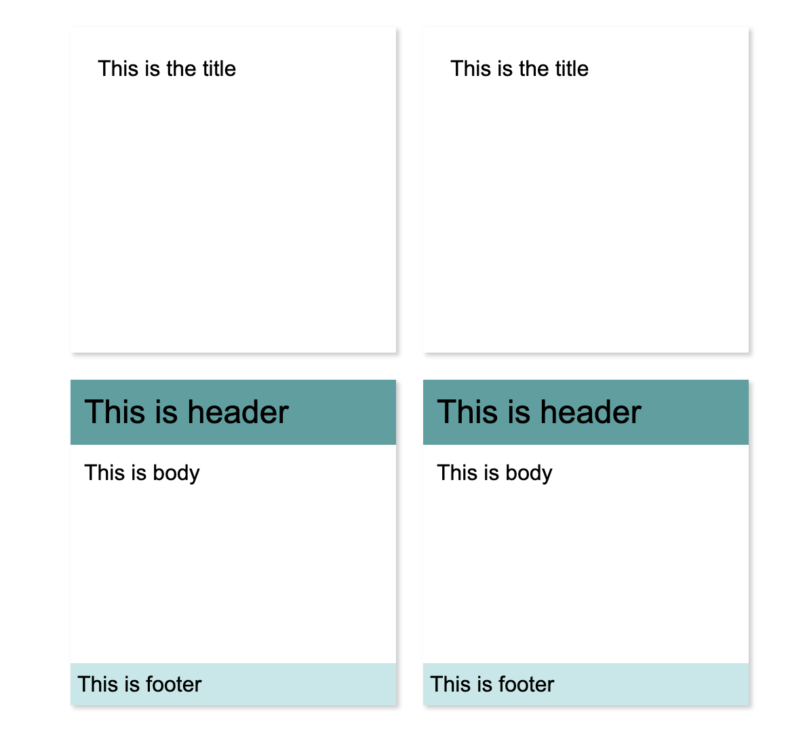

# :computer: CSS3 New Features Code Demos & more...

This repo is dedicated to all the new CSS features releasing in the CSS.
This is WIP repo and less jazzy UI (I know it should be jazzy , as we are talking about CSS).

# :grey_question: Why?

While learning new CSS3 features and making youtube videos for JSLovers, I started this repo. Also, to reduce the development efforts I have created ready-to-use code samples for the devs.

## :pushpin: TOC

### New Features

- :white_check_mark: calc
- :white_check_mark: counter
- :white_check_mark: filters
- :white_check_mark: mixins [UPDATE: NOT ANYMORE SUPPORTED]
- :white_check_mark: scroll behaviour
- :white_check_mark: variables
- :white_check_mark: writing modes
- :white_check_mark: current color
- flexbox - work in progress
- grids

### CSS + HTML Ready to use code

- :white_check_mark: Buttons
- :white_check_mark: Alerts & Notification
- :white_check_mark: Tags
- :white_check_mark: List
- :white_check_mark: Card
- Badges
- Tables
- Images
- Forms
- Navigation
- Layouts
- Gallery
- Accordion
- Icons
- Tabs
- Slideshow

## :bulb: Ready to use code - HTML and CSS

Below are the ready-to-use CSS and HTML code snippts for your project.
Right now, this is work-in-progress repo.

### CSS Buttons


### CSS Tags


### CSS Alerts


### CSS Cards



# :bulb: CSS3 New Features:

Below are the new CSS3 features code samples.

- current color

```sh
 .border{
     color: red;
     border: 1px solid currentColor;
 }
```

- Writing Modes

```sh
 .border{
     color: red;
     border: 1px solid currentColor;
 }
```

- CSS calc

```sh
 .box{
     width: calc(100 * 2px);
  }
```

- CSS filters
- CSS Mixins
- CSS Variables

```sh
:root: {
 --red : red;
}

.block {
    color :var(--red)
}

```

- CSS Grids
- CSS Flexbox

# :watch: What's next?

- Add all possible 'ready to use' codes.
- Make the code responsive.
- Make the all examples accessible.
- Add colors options.
- Add styleguide.

# :heart: Contribution

If you would like to contribute please raise the PR.

# Reach Me :woman:

You can email me at nsharma215@gmail.com or reach me on twitter @hellonehha
